# NIT Supply Chain System - Workflows Documentation

**Version:** 1.0
**Last Updated:** February 8, 2026
**Company:** Nesma Infrastructure & Technology (NIT) - Saudi Arabia

---

## Table of Contents

1. [MRRV Workflow](#1-mrrv-workflow)
2. [MIRV Workflow](#2-mirv-workflow)
3. [MRV Workflow](#3-mrv-workflow)
4. [RFIM Workflow](#4-rfim-workflow)
5. [OSD Workflow](#5-osd-workflow)
6. [Job Order Workflow](#6-job-order-workflow)
7. [Gate Pass Workflow](#7-gate-pass-workflow)
8. [Stock Transfer Workflow](#8-stock-transfer-workflow)
9. [MRF Workflow](#9-mrf-workflow)
10. [Shipment Workflow](#10-shipment-workflow)
11. [Inventory Flow](#11-inventory-flow)
12. [Approval Chain](#12-approval-chain)

---

## 1. MRRV Workflow

**Document:** Material Receiving Report Voucher
**Arabic:** سند استلام مواد
**Purpose:** Record receipt of materials from suppliers

### Status State Machine

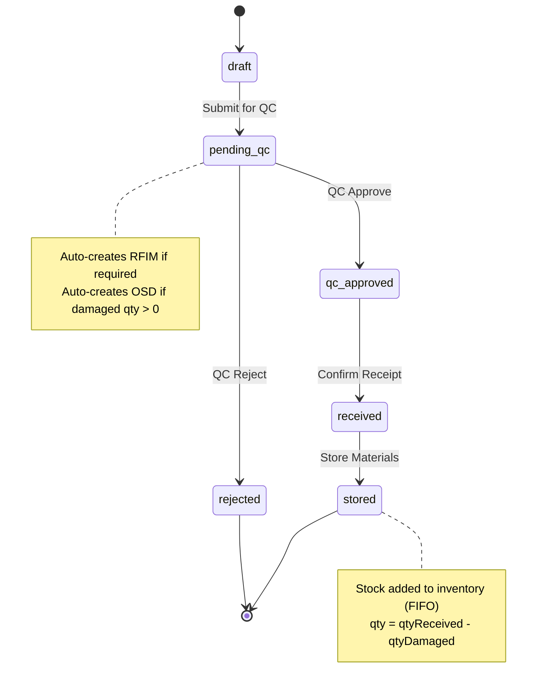

### Workflow Description

1. **Create Draft** (Warehouse Staff)
   - Enter header: Supplier, PO, Warehouse, Project, Receive Date
   - Add line items: Item, Qty Ordered, Qty Received, Qty Damaged, Unit Cost
   - Status: `draft`

2. **Submit for QC** (Warehouse Supervisor)
   - Validates all required fields complete
   - Triggers: `POST /api/mrrv/:id/submit`
   - Status: `draft` → `pending_qc`
   - **Auto-actions:**
     - If `rfimRequired = true` → Create RFIM (status: pending)
     - If any line has `qtyDamaged > 0` → Create OSD (status: draft)

3. **QC Approval** (Warehouse Supervisor or QC Officer)
   - Review materials received
   - Triggers: `POST /api/mrrv/:id/approve-qc`
   - Status: `pending_qc` → `qc_approved`
   - Records `qcInspectorId`, `qcApprovedDate`

4. **Receive Materials** (Warehouse Supervisor)
   - Confirm physical receipt
   - Triggers: `POST /api/mrrv/:id/receive`
   - Status: `qc_approved` → `received`

5. **Store Materials** (Warehouse Supervisor)
   - Put materials in storage location
   - Triggers: `POST /api/mrrv/:id/store`
   - Status: `received` → `stored`
   - **Inventory Impact:**
     - For each line: Create lot with `qty = qtyReceived - qtyDamaged`
     - Update `inventory.qtyAvailable` += lot qty

### Key Transitions

| From | To | Trigger | Who Can Perform |
|------|-----|---------|-----------------|
| draft | pending_qc | Submit | Warehouse Supervisor |
| pending_qc | qc_approved | Approve QC | Warehouse Supervisor, QC Officer |
| pending_qc | rejected | Reject QC | Warehouse Supervisor, QC Officer |
| qc_approved | received | Receive | Warehouse Supervisor |
| received | stored | Store | Warehouse Supervisor |

---

## 2. MIRV Workflow

**Document:** Material Issue Report Voucher
**Arabic:** سند صرف مواد
**Purpose:** Issue materials to projects/sites

### Status State Machine

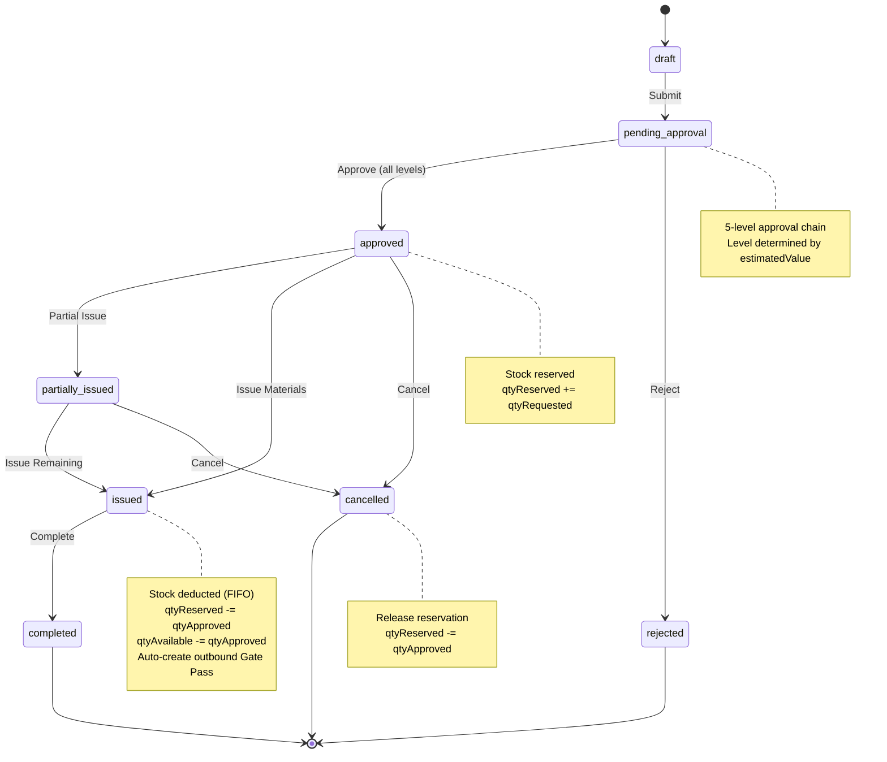

### Workflow Description

1. **Create Draft** (Engineer, Site Engineer, Warehouse Supervisor)
   - Enter header: Project, Warehouse, Location of Work, Required Date, Priority
   - Add line items: Item, Qty Requested
   - System calculates `estimatedValue = sum(item.standardCost × qtyRequested)`
   - Status: `draft`

2. **Submit for Approval** (Creator)
   - Triggers: `POST /api/mirv/:id/submit`
   - System determines required approval level based on `estimatedValue`
   - Status: `draft` → `pending_approval`
   - Creates approval record with `approverRole`, `slaHours`

3. **Approval Process** (Approver with matching role)
   - **5-Level Chain:**
     - **Level 1:** <10,000 SAR → warehouse_staff (4h SLA)
     - **Level 2:** 10,000–50,000 SAR → logistics_coordinator (8h SLA)
     - **Level 3:** 50,000–100,000 SAR → manager (24h SLA)
     - **Level 4:** 100,000–500,000 SAR → manager (48h SLA)
     - **Level 5:** >500,000 SAR → admin (72h SLA)
   - Triggers: `POST /api/mirv/:id/approve`
   - Status: `pending_approval` → `approved`
   - **Stock Impact:** Reserve stock for each line item
     - `inventory.qtyReserved` += `qtyRequested`
     - If insufficient stock: `reservationStatus = 'none'`
     - If all reserved: `reservationStatus = 'reserved'`

4. **Issue Materials** (Warehouse Staff)
   - Pick materials from warehouse
   - Triggers: `POST /api/mirv/:id/issue`
   - Status: `approved` → `issued`
   - **Stock Impact:** Consume reservation (FIFO)
     - Deduct from oldest lots first
     - `inventory.qtyReserved` -= `qtyApproved`
     - `inventory.qtyAvailable` -= `qtyApproved`
     - Calculate weighted average `unitCost` from consumed lots
   - **Auto-actions:**
     - Create outbound Gate Pass (status: pending)

5. **Complete** (System - future)
   - Triggers: Manual close or auto after gate pass returned
   - Status: `issued` → `completed`

6. **Cancel** (Manager)
   - Cancel before issue
   - Triggers: `POST /api/mirv/:id/cancel`
   - Status: `approved`/`partially_issued` → `cancelled`
   - **Stock Impact:** Release reservation
     - `inventory.qtyReserved` -= `qtyApproved`

### Key Transitions

| From | To | Trigger | Who Can Perform |
|------|-----|---------|-----------------|
| draft | pending_approval | Submit | Creator |
| pending_approval | approved | Approve | Approver (by level) |
| pending_approval | rejected | Reject | Approver |
| approved | issued | Issue | Warehouse Staff |
| approved | cancelled | Cancel | Manager |
| issued | completed | Complete | Manager |

---

## 3. MRV Workflow

**Document:** Material Return Voucher
**Arabic:** سند إرجاع مواد
**Purpose:** Return materials from project to warehouse

### Status State Machine

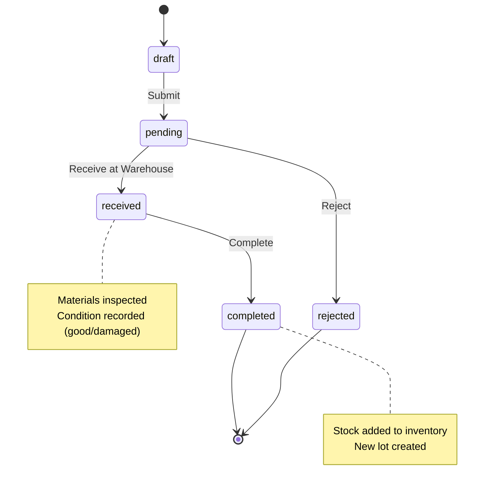

### Workflow Description

1. **Create Draft** (Warehouse Staff, Site Engineer)
   - Enter header: Project, Warehouse, Return Type (excess/damaged/unused/expired)
   - Add line items: Item, Qty Returned, Condition (good/damaged/expired)
   - Status: `draft`

2. **Submit for Receipt** (Creator)
   - Triggers: `POST /api/mrv/:id/submit`
   - Status: `draft` → `pending`

3. **Receive at Warehouse** (Warehouse Supervisor)
   - Inspect returned materials
   - Verify condition matches claimed
   - Triggers: `POST /api/mrv/:id/receive`
   - Status: `pending` → `received`

4. **Complete** (Warehouse Supervisor)
   - Put away materials
   - Triggers: `POST /api/mrv/:id/complete`
   - Status: `received` → `completed`
   - **Stock Impact:** Add returned qty to inventory
     - Create new lot (not merged with existing)
     - If condition = 'good': `qtyAvailable` += `qtyReturned`
     - If condition = 'damaged': Add to separate damaged bin (or exclude from available)

5. **Reject** (Warehouse Supervisor)
   - Materials not accepted (wrong items, etc.)
   - Triggers: `POST /api/mrv/:id/reject`
   - Status: `pending` → `rejected`
   - No stock impact

### Key Transitions

| From | To | Trigger | Who Can Perform |
|------|-----|---------|-----------------|
| draft | pending | Submit | Creator |
| pending | received | Receive | Warehouse Supervisor |
| pending | rejected | Reject | Warehouse Supervisor |
| received | completed | Complete | Warehouse Supervisor |

---

## 4. RFIM Workflow

**Document:** Request for Inspection of Materials
**Arabic:** طلب فحص مواد
**Purpose:** QC inspection of received materials

### Status State Machine

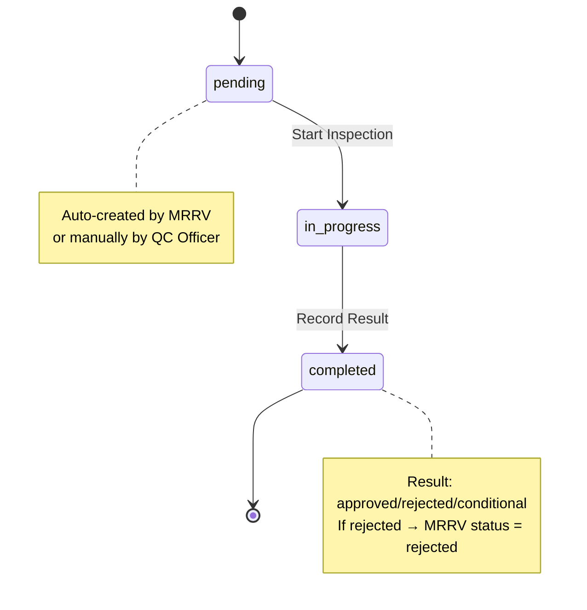

### Workflow Description

1. **Create RFIM** (Auto or Manual)
   - **Auto-creation:** MRRV with `rfimRequired=true` submits → creates RFIM
   - **Manual creation:** QC Officer creates standalone RFIM
   - Enter: MRRV reference (if auto), inspection type, priority
   - Status: `pending`

2. **Start Inspection** (QC Officer)
   - Claim RFIM
   - Triggers: `POST /api/rfim/:id/start`
   - Status: `pending` → `in_progress`
   - Records `qcInspectorId`, `inspectionStartDate`

3. **Complete Inspection** (QC Officer)
   - Record result: approved/rejected/conditional_approval
   - Add notes, photos, defect descriptions
   - Triggers: `POST /api/rfim/:id/complete`
   - Status: `in_progress` → `completed`
   - **Impact on linked MRRV:**
     - If result = 'rejected' → MRRV status = `rejected`
     - If result = 'approved' → MRRV can proceed to next step

### Key Transitions

| From | To | Trigger | Who Can Perform |
|------|-----|---------|-----------------|
| pending | in_progress | Start | QC Officer |
| in_progress | completed | Complete | QC Officer |

---

## 5. OSD Workflow

**Document:** Over/Short/Damage Report
**Arabic:** تقرير نقص/تلف
**Purpose:** Document and track material discrepancies

### Status State Machine

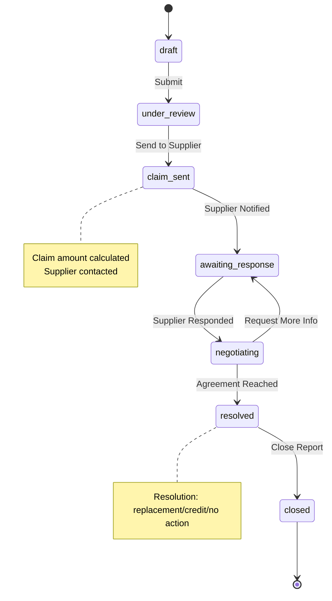

### Workflow Description

1. **Create Draft** (Warehouse Staff)
   - **Auto-creation:** MRRV with `qtyDamaged > 0` submits → creates OSD
   - **Manual creation:** Warehouse staff creates standalone OSD
   - Enter: MRRV reference (if auto), supplier, report type (damage/shortage/overage)
   - Add line items: Item, Qty Invoice, Qty Received, Qty Damaged/Short/Over, Damage Type, Unit Cost
   - Calculate `claimAmount = sum(unitCost × qtyDamaged)`
   - Status: `draft`

2. **Submit for Review** (Warehouse Staff)
   - Triggers: `POST /api/osd/:id/submit`
   - Status: `draft` → `under_review`

3. **Internal Review** (Manager)
   - Validate claim, review evidence (photos)
   - Triggers: `POST /api/osd/:id/approve-internal`
   - Status: `under_review` → `claim_sent`

4. **Send Claim to Supplier** (Manager)
   - Notify supplier of claim
   - Triggers: `POST /api/osd/:id/send-claim`
   - Status: `claim_sent` → `awaiting_response`

5. **Supplier Response** (Logistics Coordinator - on behalf of supplier)
   - Record supplier's reply
   - Triggers: `POST /api/osd/:id/supplier-response`
   - Status: `awaiting_response` → `negotiating`

6. **Negotiate** (Manager, Logistics Coordinator)
   - Back-and-forth negotiation
   - Triggers: `POST /api/osd/:id/update-status`
   - Status remains `negotiating` until resolved

7. **Resolve** (Manager)
   - Record resolution: replacement, credit note, no action
   - Triggers: `POST /api/osd/:id/resolve`
   - Status: `negotiating` → `resolved`

8. **Close** (Manager)
   - Final closure
   - Triggers: `POST /api/osd/:id/close`
   - Status: `resolved` → `closed`

### Key Transitions

| From | To | Trigger | Who Can Perform |
|------|-----|---------|-----------------|
| draft | under_review | Submit | Warehouse Staff |
| under_review | claim_sent | Approve | Manager |
| claim_sent | awaiting_response | Send Claim | Manager |
| awaiting_response | negotiating | Record Response | Logistics Coordinator |
| negotiating | resolved | Resolve | Manager |
| resolved | closed | Close | Manager |

---

## 6. Job Order Workflow

**Document:** Job Order (7 Types)
**Arabic:** أمر عمل
**Purpose:** Manage logistics operations (transport, equipment, generators, scrap)

### Status State Machine

```mermaid
stateDiagram-v2
    [*] --> draft
    draft --> pending_approval : Submit
    pending_approval --> quoted : Quote Received
    pending_approval --> approved : Approve
    pending_approval --> rejected : Reject
    quoted --> approved : Approve Quote
    approved --> assigned : Assign Supplier
    assigned --> in_progress : Start Work
    in_progress --> on_hold : Put on Hold
    on_hold --> in_progress : Resume
    in_progress --> completed : Complete Work
    completed --> invoiced : Invoice Received
    invoiced --> [*]
    rejected --> [*]
    approved --> cancelled : Cancel
    assigned --> cancelled : Cancel
    cancelled --> [*]

    note right of pending_approval
        4-level approval chain
        Level based on totalAmount
        SLA timer starts
    end note

    note right on_hold
        Stop SLA clock
        Record reason
    end note

    note right of in_progress
        Resume: SLA due date extended
        by paused duration
    end note

    note right of completed
        SLA evaluated:
        completed <= slaDueDate → met
    end note
```

### Workflow Description

1. **Create Draft** (Logistics Coordinator, Site Engineer, Manager)
   - Select JO type: transport/equipment/rental_monthly/rental_daily/scrap/generator_rental/generator_maintenance
   - Enter header: Project, Supplier (optional), Total Amount, Required Date, Priority
   - Enter type-specific details:
     - **Transport:** Pickup/delivery locations, cargo type, weight
     - **Equipment:** Multi-line (equipment type, qty, with operator, daily rate)
     - **Rental:** Start/end dates, monthly/daily rate, with operator
     - **Generator:** Generator ID, capacity KVA, shift times, maintenance type
     - **Scrap:** Scrap type, weight, destination
   - Status: `draft`

2. **Submit for Approval** (Creator)
   - Triggers: `POST /api/job-orders/:id/submit`
   - System determines approval level based on `totalAmount`
   - Status: `draft` → `pending_approval`
   - Creates SLA tracking: `slaDueDate = now + slaHours`

3. **Approval Process** (Approver by level)
   - **4-Level Chain:**
     - **Level 1:** <5,000 SAR → logistics_coordinator (4h)
     - **Level 2:** 5,000–20,000 SAR → manager (8h)
     - **Level 3:** 20,000–100,000 SAR → manager (24h)
     - **Level 4:** >100,000 SAR → admin (48h)
   - Option 1: **Approve**
     - Triggers: `POST /api/job-orders/:id/approve`
     - Status: `pending_approval` → `approved`
   - Option 2: **Request Quote**
     - Supplier provides quote
     - Status: `pending_approval` → `quoted`
     - Then approve quote → `approved`
   - Option 3: **Reject**
     - Triggers: `POST /api/job-orders/:id/reject`
     - Status: `pending_approval` → `rejected`

4. **Assign Supplier** (Logistics Coordinator)
   - Select supplier (or confirm existing)
   - Triggers: `POST /api/job-orders/:id/assign`
   - Status: `approved` → `assigned`

5. **Start Work** (Logistics Coordinator)
   - Work begins
   - Triggers: `POST /api/job-orders/:id/start`
   - Status: `assigned` → `in_progress`
   - Records `startDate`

6. **Hold Work** (Logistics Coordinator, Manager)
   - Pause work (e.g., awaiting parts, weather delay)
   - Triggers: `POST /api/job-orders/:id/hold`
   - Status: `in_progress` → `on_hold`
   - **SLA Impact:** Stop clock
     - Records `stopClockStart`, `stopClockReason`

7. **Resume Work** (Logistics Coordinator, Manager)
   - Work resumes
   - Triggers: `POST /api/job-orders/:id/resume`
   - Status: `on_hold` → `in_progress`
   - **SLA Impact:** Restart clock
     - Records `stopClockEnd`
     - Extends `slaDueDate` by paused duration: `newDueDate = oldDueDate + (stopClockEnd - stopClockStart)`

8. **Complete Work** (Logistics Coordinator, Manager)
   - Work finished
   - Triggers: `POST /api/job-orders/:id/complete`
   - Status: `in_progress` → `completed`
   - Records `completionDate`, `completedById`
   - **SLA Evaluation:**
     - If `completionDate <= slaDueDate` → `slaMet = true`
     - Else → `slaMet = false`

9. **Invoice Received** (Logistics Coordinator, Manager)
   - Supplier invoice received
   - Triggers: `POST /api/job-orders/:id/invoice`
   - Status: `completed` → `invoiced`
   - Creates payment record: invoice number, cost, VAT, grand total, payment status

10. **Cancel** (Manager, Admin)
    - Cancel before completion
    - Triggers: `POST /api/job-orders/:id/cancel`
    - Status: `approved`/`assigned`/`in_progress` → `cancelled`

### Key Transitions

| From | To | Trigger | Who Can Perform |
|------|-----|---------|-----------------|
| draft | pending_approval | Submit | Creator |
| pending_approval | approved | Approve | Approver (by level) |
| pending_approval | quoted | Request Quote | Approver |
| pending_approval | rejected | Reject | Approver |
| quoted | approved | Approve Quote | Approver |
| approved | assigned | Assign Supplier | Logistics Coordinator |
| assigned | in_progress | Start Work | Logistics Coordinator |
| in_progress | on_hold | Put on Hold | Logistics Coordinator, Manager |
| on_hold | in_progress | Resume | Logistics Coordinator, Manager |
| in_progress | completed | Complete | Logistics Coordinator, Manager |
| completed | invoiced | Invoice Received | Logistics Coordinator, Manager |
| approved/assigned | cancelled | Cancel | Manager, Admin |

---

## 7. Gate Pass Workflow

**Document:** Gate Pass
**Arabic:** تصريح دخول/خروج
**Purpose:** Control material entry/exit at warehouse gates

### Status State Machine

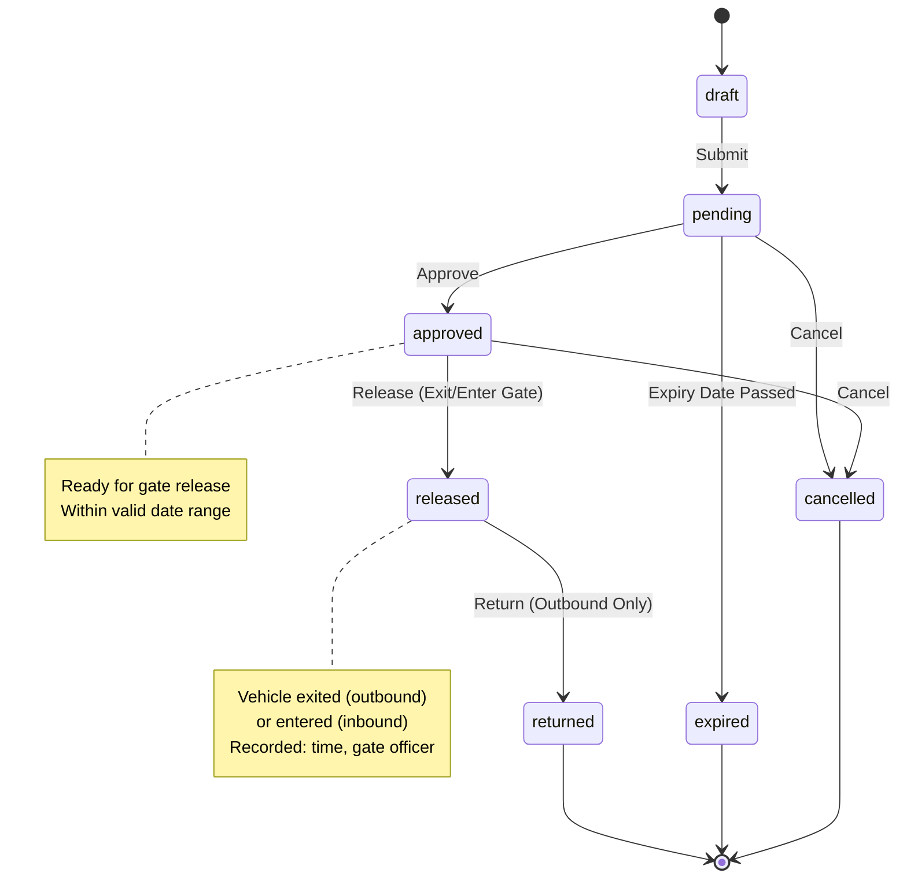

### Workflow Description

1. **Create Draft** (Warehouse Staff, Logistics Coordinator)
   - **Auto-creation:** MIRV issued → creates outbound gate pass
   - **Manual creation:** User creates gate pass
   - Enter: Pass Type (inbound/outbound), Linked Document (MIRV/MRV/Stock Transfer), Warehouse, Vehicle Number, Driver Name, Destination/Origin, Valid Until
   - Status: `draft`

2. **Submit for Approval** (Creator)
   - Triggers: `POST /api/gate-passes/:id/submit`
   - Status: `draft` → `pending`

3. **Approve** (Warehouse Supervisor, Manager)
   - Validate linked document, vehicle details
   - Triggers: `POST /api/gate-passes/:id/approve`
   - Status: `pending` → `approved`

4. **Release at Gate** (Gate Officer - Warehouse Staff)
   - Vehicle exits (outbound) or enters (inbound)
   - Triggers: `POST /api/gate-passes/:id/release`
   - Status: `approved` → `released`
   - Records `releaseTime`, `gateOfficerId`

5. **Return (Outbound Only)** (Gate Officer)
   - Vehicle returns to warehouse
   - Triggers: `POST /api/gate-passes/:id/return`
   - Status: `released` → `returned`
   - Records `returnTime`

6. **Expire** (System - Auto)
   - Pass not used before `validUntil` date
   - Triggers: Cron job checks daily
   - Status: `pending`/`approved` → `expired`

7. **Cancel** (Warehouse Supervisor, Manager)
   - Cancel before release
   - Triggers: `POST /api/gate-passes/:id/cancel`
   - Status: `pending`/`approved` → `cancelled`

### Key Transitions

| From | To | Trigger | Who Can Perform |
|------|-----|---------|-----------------|
| draft | pending | Submit | Creator |
| pending | approved | Approve | Warehouse Supervisor, Manager |
| approved | released | Release | Gate Officer (Warehouse Staff) |
| released | returned | Return | Gate Officer |
| pending/approved | expired | System Auto | System (Cron) |
| pending/approved | cancelled | Cancel | Warehouse Supervisor, Manager |

---

## 8. Stock Transfer Workflow

**Document:** Stock Transfer
**Arabic:** نقل مخزون
**Purpose:** Move inventory between warehouses

### Status State Machine

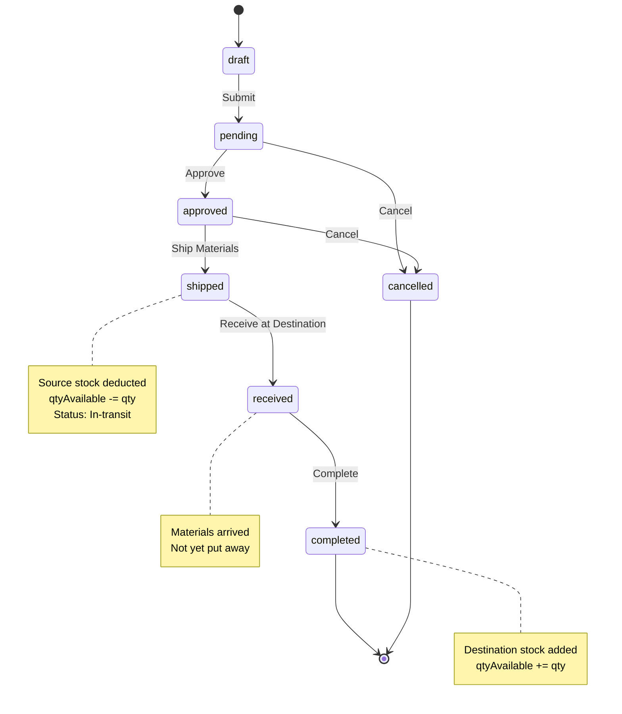

### Workflow Description

1. **Create Draft** (Warehouse Supervisor, Logistics Coordinator)
   - Enter: From Warehouse, To Warehouse, Transfer Date, Reason
   - Add line items: Item, Qty, Lot Selection (optional - system auto-selects FIFO)
   - Status: `draft`

2. **Submit for Approval** (Creator)
   - Triggers: `POST /api/stock-transfers/:id/submit`
   - Status: `draft` → `pending`

3. **Approve** (Manager)
   - Validate source warehouse has sufficient stock
   - Triggers: `POST /api/stock-transfers/:id/approve`
   - Status: `pending` → `approved`

4. **Ship Materials** (Source Warehouse Supervisor)
   - Pack materials for transport
   - Triggers: `POST /api/stock-transfers/:id/ship`
   - Status: `approved` → `shipped`
   - **Stock Impact (Source):**
     - Deduct from source warehouse
     - `inventory[source].qtyAvailable` -= `qty`
     - Lot status: in_transit

5. **Receive at Destination** (Destination Warehouse Supervisor)
   - Confirm materials arrived
   - Triggers: `POST /api/stock-transfers/:id/receive`
   - Status: `shipped` → `received`

6. **Complete** (Destination Warehouse Supervisor)
   - Put away materials in destination warehouse
   - Triggers: `POST /api/stock-transfers/:id/complete`
   - Status: `received` → `completed`
   - **Stock Impact (Destination):**
     - Add to destination warehouse
     - `inventory[destination].qtyAvailable` += `qty`
     - Create new lot at destination (same cost basis as source)

7. **Cancel** (Manager)
   - Cancel before shipping
   - Triggers: `POST /api/stock-transfers/:id/cancel`
   - Status: `pending`/`approved` → `cancelled`

### Key Transitions

| From | To | Trigger | Who Can Perform |
|------|-----|---------|-----------------|
| draft | pending | Submit | Creator |
| pending | approved | Approve | Manager |
| approved | shipped | Ship | Source Warehouse Supervisor |
| shipped | received | Receive | Destination Warehouse Supervisor |
| received | completed | Complete | Destination Warehouse Supervisor |
| pending/approved | cancelled | Cancel | Manager |

---

## 9. MRF Workflow

**Document:** Material Requisition Form
**Arabic:** طلب توريد مواد
**Purpose:** Request materials; system routes to stock issue or purchase

### Status State Machine

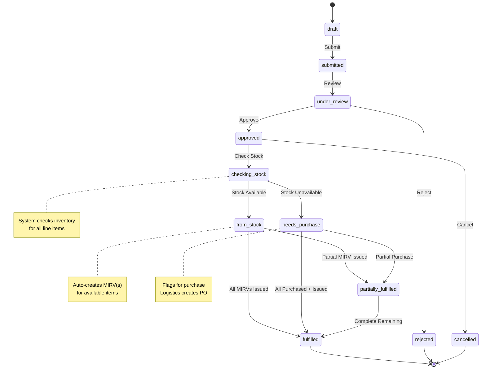

### Workflow Description

1. **Create Draft** (Engineer, Site Engineer)
   - Enter: Project, Requester, Line items (Item, Qty Requested, Justification)
   - System calculates `estimatedValue = sum(item.standardCost × qtyRequested)`
   - Status: `draft`

2. **Submit** (Creator)
   - Triggers: `POST /api/mrf/:id/submit`
   - Status: `draft` → `submitted`

3. **Review** (Manager, Logistics Coordinator)
   - Review justification, priority
   - Triggers: `POST /api/mrf/:id/review`
   - Status: `submitted` → `under_review`

4. **Approve** (Approver by level - same as MIRV 5-level)
   - Triggers: `POST /api/mrf/:id/approve`
   - Status: `under_review` → `approved`

5. **Check Stock** (System - Auto or Manual)
   - System queries inventory for each line item
   - Triggers: `POST /api/mrf/:id/check-stock`
   - Status: `approved` → `checking_stock`
   - **Logic:**
     - For each item: Compare `qtyRequested` vs `sum(inventory.qtyAvailable)` across all warehouses
     - If all items available → `from_stock`
     - If some items unavailable → split: available → `from_stock`, unavailable → `needs_purchase`
     - If no items available → `needs_purchase`

6. **From Stock** (System or Logistics Coordinator)
   - All/some items available
   - Triggers: `POST /api/mrf/:id/fulfill-from-stock`
   - Status: `checking_stock` → `from_stock`
   - **Auto-actions:**
     - Create MIRV(s) for available items (one per warehouse if multi-warehouse)
     - MIRV status: `draft` (user must submit for approval)

7. **Needs Purchase** (Logistics Coordinator)
   - Some/all items unavailable
   - Triggers: Manual flag or system auto
   - Status: `checking_stock` → `needs_purchase`
   - **Manual Action:**
     - Logistics Coordinator creates PO for unavailable items (outside system or future PO module)

8. **Partially Fulfilled** (System - triggered by MIRV issue)
   - Some MIRVs issued, some pending
   - Status: `from_stock`/`needs_purchase` → `partially_fulfilled`
   - Tracks `qtyFulfilled` vs `qtyRequested` per line

9. **Fulfilled** (System - auto when all fulfilled)
   - All items issued
   - Status: `partially_fulfilled`/`from_stock`/`needs_purchase` → `fulfilled`

10. **Cancel** (Manager)
    - Cancel before fulfillment
    - Triggers: `POST /api/mrf/:id/cancel`
    - Status: `approved` → `cancelled`

### Key Transitions

| From | To | Trigger | Who Can Perform |
|------|-----|---------|-----------------|
| draft | submitted | Submit | Creator |
| submitted | under_review | Review | Manager, Logistics Coordinator |
| under_review | approved | Approve | Approver (by level) |
| under_review | rejected | Reject | Approver |
| approved | checking_stock | Check Stock | System or Logistics Coordinator |
| checking_stock | from_stock | Stock Available | System |
| checking_stock | needs_purchase | Stock Unavailable | System |
| from_stock/needs_purchase | partially_fulfilled | Partial Issue | System (MIRV trigger) |
| partially_fulfilled | fulfilled | Complete | System (all MIRVs issued) |
| approved | cancelled | Cancel | Manager |

---

## 10. Shipment Workflow

**Document:** Shipment (with embedded Customs Clearance)
**Arabic:** شحنة / تخليص جمركي
**Purpose:** Track international shipments from PO to delivery

### Status State Machine

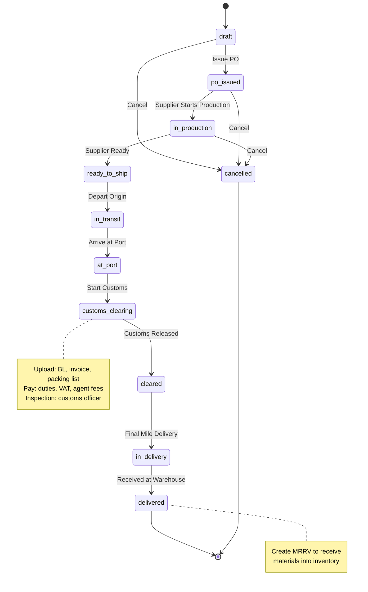

### Workflow Description

1. **Create Draft** (Logistics Coordinator)
   - Enter: Supplier, Description, PO Number, ETD, ETA, Port, Shipment Mode (sea/air/land), Customs Agent
   - Status: `draft`

2. **Issue PO** (Logistics Coordinator)
   - Purchase order sent to supplier
   - Triggers: `POST /api/shipments/:id/issue-po`
   - Status: `draft` → `po_issued`

3. **In Production** (Logistics Coordinator - updated by supplier)
   - Supplier manufacturing/preparing goods
   - Triggers: `POST /api/shipments/:id/update-status`
   - Status: `po_issued` → `in_production`

4. **Ready to Ship** (Logistics Coordinator)
   - Goods packed, awaiting pickup
   - Triggers: `POST /api/shipments/:id/update-status`
   - Status: `in_production` → `ready_to_ship`

5. **In Transit** (Logistics Coordinator)
   - Goods departed origin port/airport
   - Triggers: `POST /api/shipments/:id/update-status`
   - Status: `ready_to_ship` → `in_transit`
   - Records `actualDepartureDate`

6. **At Port** (Logistics Coordinator)
   - Arrived at destination port
   - Triggers: `POST /api/shipments/:id/update-status`
   - Status: `in_transit` → `at_port`
   - Records `actualArrivalDate`
   - **Delay Check:** If `actualArrivalDate > ETA` → flag as delayed

7. **Customs Clearing** (Freight Forwarder, Logistics Coordinator)
   - Submit documents to customs
   - Triggers: `POST /api/shipments/:id/start-customs`
   - Status: `at_port` → `customs_clearing`
   - **Required Documents:**
     - Bill of Lading (BL)
     - Commercial Invoice
     - Packing List
     - Certificate of Origin
   - **Actions:**
     - Upload documents: `POST /api/shipments/:id/upload-document`
     - Record fees: Customs duty, VAT (15%), clearing agent fee
     - Customs inspection: pass/hold/reject

8. **Cleared** (Freight Forwarder, Logistics Coordinator)
   - Customs released
   - Triggers: `POST /api/shipments/:id/clear-customs`
   - Status: `customs_clearing` → `cleared`
   - Records `customsReleaseDate`, `customsReleaseReference`

9. **In Delivery** (Logistics Coordinator)
   - Final mile delivery to warehouse
   - Triggers: `POST /api/shipments/:id/update-status`
   - Status: `cleared` → `in_delivery`

10. **Delivered** (Logistics Coordinator)
    - Received at warehouse
    - Triggers: `POST /api/shipments/:id/deliver`
    - Status: `in_delivery` → `delivered`
    - Records `deliveryDate`, `deliverySignature` (photo/scan)
    - **Next Step:** Create MRRV to receive materials into inventory

11. **Cancel** (Manager)
    - Cancel before arrival
    - Triggers: `POST /api/shipments/:id/cancel`
    - Status: `draft`/`po_issued`/`in_production` → `cancelled`

### Key Transitions

| From | To | Trigger | Who Can Perform |
|------|-----|---------|-----------------|
| draft | po_issued | Issue PO | Logistics Coordinator |
| po_issued | in_production | Update | Logistics Coordinator |
| in_production | ready_to_ship | Update | Logistics Coordinator |
| ready_to_ship | in_transit | Update | Logistics Coordinator |
| in_transit | at_port | Update | Logistics Coordinator |
| at_port | customs_clearing | Start Customs | Freight Forwarder, Logistics Coordinator |
| customs_clearing | cleared | Clear Customs | Freight Forwarder, Logistics Coordinator |
| cleared | in_delivery | Update | Logistics Coordinator |
| in_delivery | delivered | Deliver | Logistics Coordinator |
| draft/po_issued/in_production | cancelled | Cancel | Manager |

---

## 11. Inventory Flow

### How Documents Affect Stock Levels

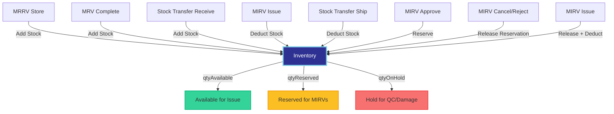

### Stock Level Formula

```
inventory.qtyOnHand = qtyAvailable + qtyReserved + qtyOnHold

qtyAvailable: Stock that can be issued
qtyReserved: Stock reserved for approved MIRVs
qtyOnHold: Stock under QC or damaged
```

### FIFO Lot Consumption Logic

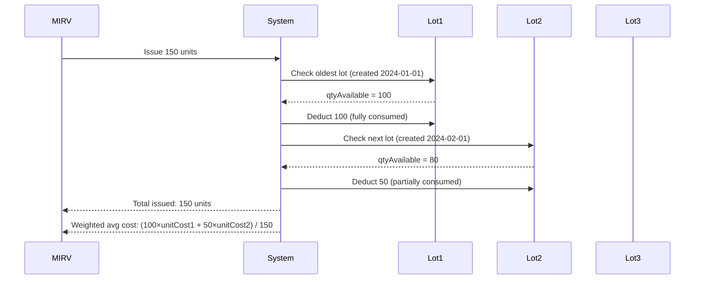

### Negative Inventory Prevention

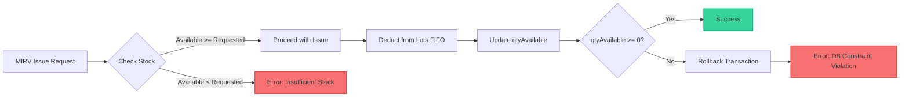

**Safeguards:**
1. **Application Validation:** Before deduction, check `qtyAvailable >= qtyRequested`
2. **Database Constraint:** `CHECK (qtyAvailable >= 0)` on `inventory` table
3. **Transaction Rollback:** If constraint violated, entire transaction rolls back

---

## 12. Approval Chain

### Multi-level Approval Process

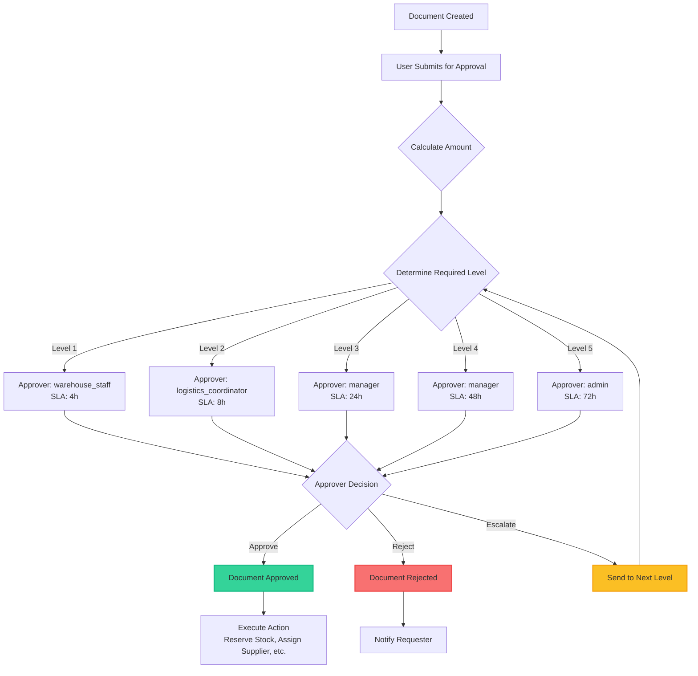

### Approval Level Determination Logic

```typescript
function getRequiredApprovalLevel(documentType: 'mirv' | 'jo' | 'mrf', amount: number) {
  const levels = documentType === 'jo' ? JO_APPROVAL_LEVELS : MIRV_APPROVAL_LEVELS;

  // Find level where amount falls within range
  for (const level of levels) {
    if (amount >= level.minAmount && amount < level.maxAmount) {
      return level;
    }
  }

  // If amount exceeds all ranges, return highest level
  return levels[levels.length - 1];
}
```

### SLA Tracking

```mermaid
gantt
    title MIRV Approval SLA Timeline (Level 3 - 75,000 SAR)
    dateFormat YYYY-MM-DD HH:mm
    axisFormat %H:%M

    section Submission
    Document Submitted :milestone, m1, 2026-02-08 09:00, 0h

    section SLA Window
    SLA Period (24h) :active, sla1, 2026-02-08 09:00, 24h
    SLA Due :crit, milestone, m2, 2026-02-09 09:00, 0h

    section Actual Approval
    Approved at 15:30 :done, a1, 2026-02-08 09:00, 6.5h

    section Outcome
    SLA Met ✓ :milestone, m3, 2026-02-08 15:30, 0h
```

**SLA Calculation:**
- `slaDueDate = submittedDate + slaHours`
- `slaMet = (approvedDate <= slaDueDate)`

---

## Workflow Integration Example

### End-to-End Flow: Supplier → Warehouse → Project

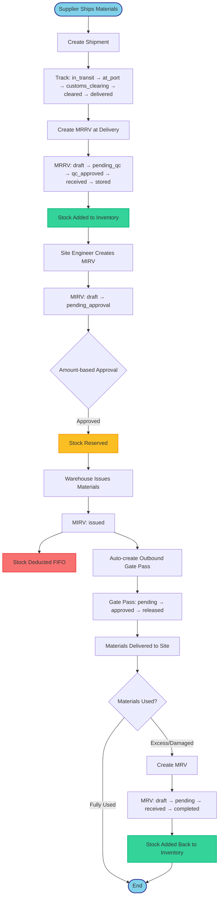

---

**End of WORKFLOWS.md**
